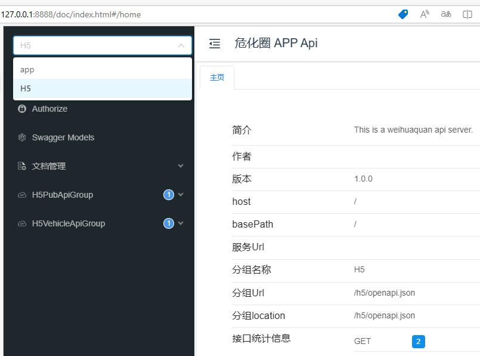

```go
// example 
engine := gin.Default()
// app
appFizz := fizz.NewFromEngine(engine)
appInfos := &openapi.Info{
   Title:       "Fruits Market",
   Description: `This is a sample Fruits market server.`,
   Version:     "1.0.0",
}
appFizz.GET("/app/openapi.json", nil, appFizz.OpenAPI(appInfos, "json"))

// h5
h5Fizz := fizz.NewFromEngine(engine)
h5Infos := &openapi.Info{
   Title:       "Fruits Market",
   Description: `This is a sample Fruits market server.`,
   Version:     "1.0.0",
}
h5Fizz.GET("/h5/openapi.json", nil, h5Fizz.OpenAPI(h5Infos, "json"))

// add a OpenApi UI with groups
ui.AddUIGroupHandler(engine, "/doc", ui.SwaggerUrl{
		Name: "app",
		Url:  "/app/openapi.json",
	}, ui.SwaggerUrl{
		Name: "H5",
		Url:  "/h5/openapi.json",
	})

```

And then you can get a api document with ui like follows

